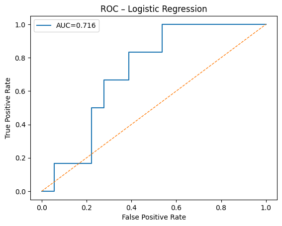
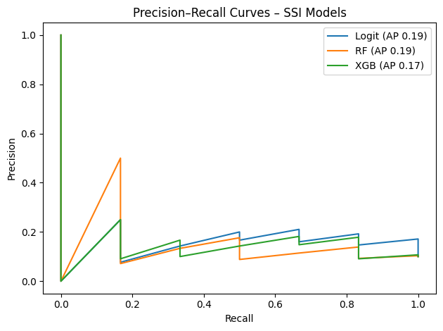
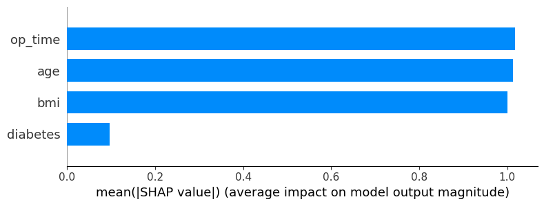

# Surgical Site Infection (SSI) Prediction

## Goal
Build and evaluate baseline models to predict postoperative surgical site infection using structured clinical and operative data.

## Dataset
- Source: [UCI Surgical Site Infection Dataset](https://archive.ics.uci.edu/ml/datasets/Surgical+Site+Infections)  
- Alternate: synthetic dataset generated for demo (`ssi_prediction_starter.ipynb`)
- Target variable: `ssi` (0 = no infection, 1 = infection)

## Methods
- Logistic Regression | Random Forest | XGBoost  
- Metrics: ROC AUC, PR curve, Confusion Matrix, Calibration  
- Explainability: SHAP summary plots

## Reproduce
1. Clone this repo or download the notebook.  
2. Place your dataset at `data/ssi_data.csv`.  
3. Run `notebooks/ssi_prediction_starter.ipynb` top-to-bottom.  
4. View results in `reports/figures/`.

## Outputs
- `reports/figures/roc.png`, `pr.png`, `shap.png`  
- `reports/ssi_summary.pdf` (300–400 word abstract)
  
### Figures

## Notes
- Uses public or synthetic data – no PHI/PII.  
- Baseline for future surgical-outcomes collaboration.
